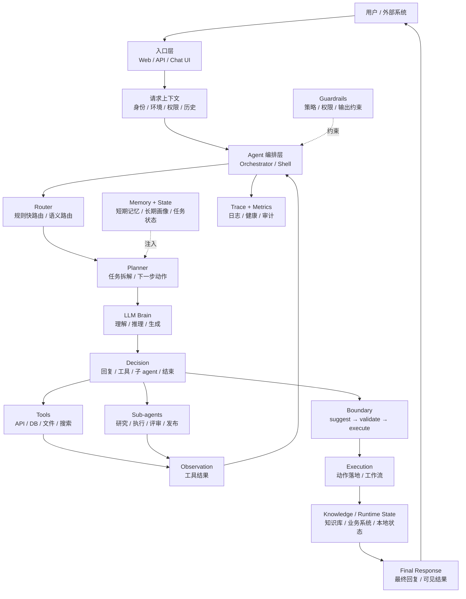
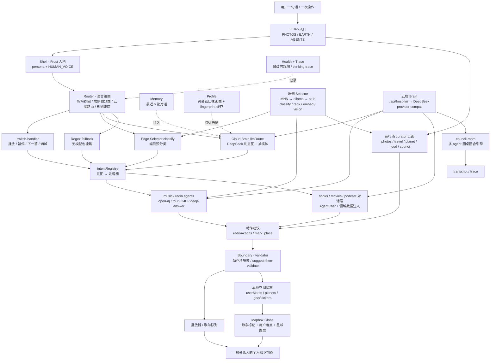

# Pocket Earth · Agent 架构图 Mermaid 版

## 版本 A：通用 Agent 架构

## 版本 B：Pocket Earth 当前 frost-agent 架构

## 口径摘要

- frost-agent 不是聊天机器人，而是主 Frost 编排子 curator 的 harness。
- 端侧 Selector 管「挑和找」：分类、排序、嵌入、视觉打标、照片价值打分。
- 云端 Brain 管「写」：叙事、推荐、回答、圆桌发言。
- 子 agent 只建议动作，所有落点和播放动作都必须经过 Boundary 校验。
- 所有地理产出最终汇入同一颗 Mapbox 地球：`userMarks`、`planets`、`geoStickers`。
